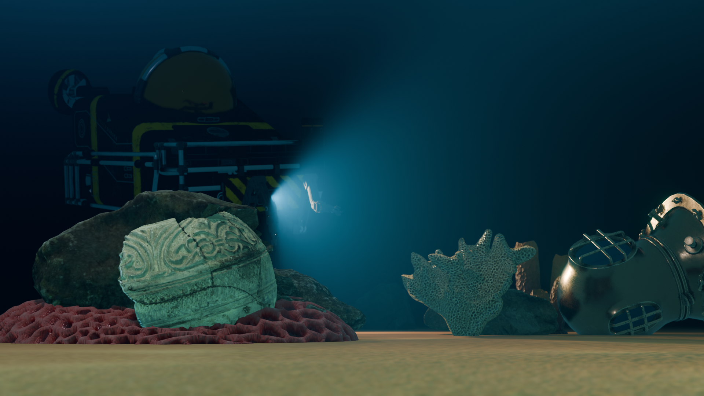
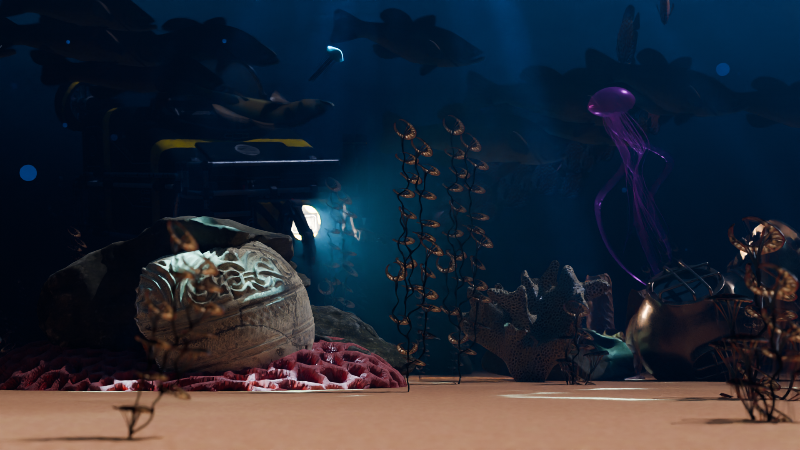
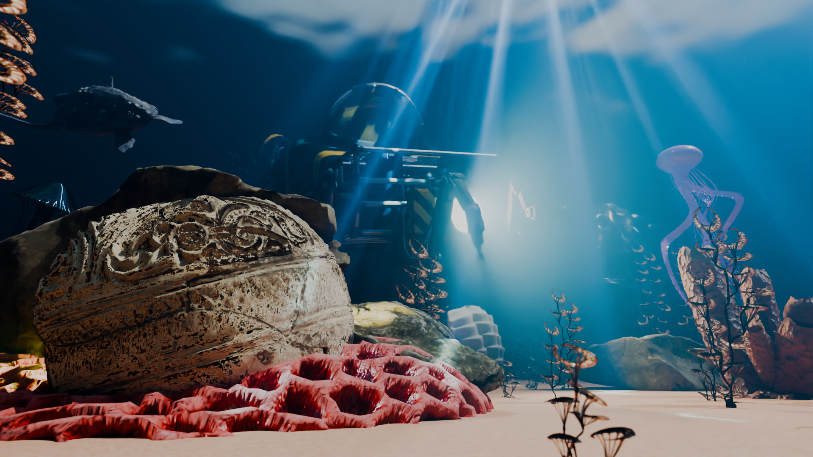
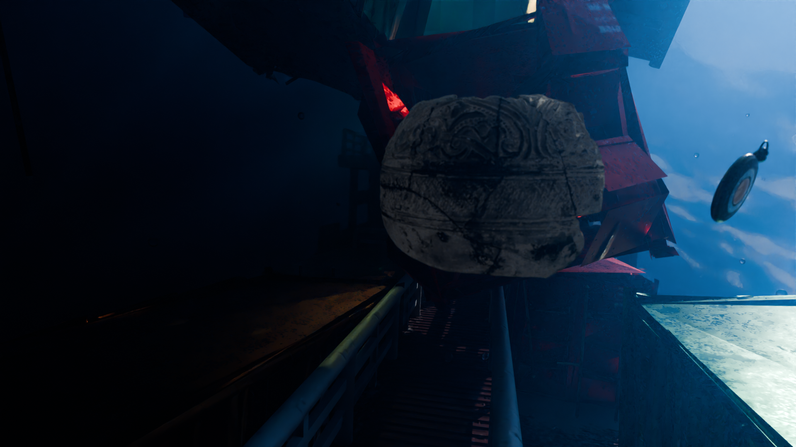

# Project SEA2

## Scenario
Underwater scene, sinking ship  
Action starts from underwater view near the surface, no seabed is visible.
A turtle shows up at the right screen corner, the camera flies forward after the turtle capturing a jellyfish and a shoal of tropical fish.
The turtle swims left, the camera dives to depth.
The cargo ship sinks. The camera flies above the ship deck.
The prins jellyfish is visible on the screen. A shoal of fish swims alogside the ship.
The camera stops in front of opened cargo. The vase fragment floats from the cargo to the camera.
An antique golden watch floating nearby the vase. As it ticks time goes backwards…

## Etap 1
**Eevee**

## Etap 2
### First render
**Cycles** 64spl

### Second render
**Cycles** 271spl

### Final render
**Cycles** 1024spl

Compositing

## Etap 3
### First renders
Frame 398 (512spl)

Frame 182 (128spl)

## Usefull
- [Materials](https://FreePBR.com)
- [Models](https://sketchfab.com)
- [Materials, models, HDR's](https://polyhaven.com)
- [Texture generator](https://cpetry.github.io/NormalMap-Online/)
- [Sounds](https://pixabay.com/sound-effects/)

## Import
[import](IMPORT.md)

Shield: [![CC BY-NC 4.0][cc-by-nc-shield]][cc-by-nc]

[cc-by-nc]: http://creativecommons.org/licenses/by-nc/4.0/
[cc-by-nc-shield]: https://img.shields.io/badge/License-CC%20BY--NC%204.0-lightgrey.svg

 This work is licensed under a <a rel="license" href="http://creativecommons.org/licenses/by-nc/4.0/">Creative Commons Attribution-NonCommercial 4.0 International License</a>.
